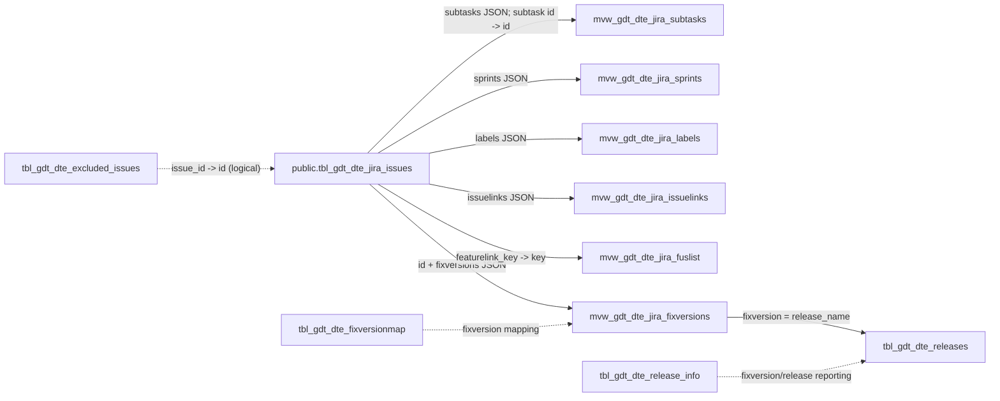

# Jira Issues Table Guide

## 1. Purpose of This Document

This guide explains the Jira issue data stored in DoraDB for someone who is new to databases, Jira, or software-delivery reporting. It also gives future AI assistants a verified reference so they do not invent fields or overstate what the data proves.

The main table is `public.tbl_gdt_dte_jira_issues`. This document covers all 26 columns in that table.

### Evidence and inspection scope

The statements in this guide were checked on 2026-08-03 using read-only inspection of:

- The live PostgreSQL database `doradb`, including `information_schema`, PostgreSQL catalog metadata, aggregate counts, constraints, indexes, materialized-view definitions, and non-sensitive data-quality checks.
- The table definition in [`backup/playgrounddb`](../../backup/playgrounddb), especially the `CREATE TABLE public.tbl_gdt_dte_jira_issues` statement.
- Repository queries in [`backend/app/approved_sql`](../../backend/app/approved_sql).
- Query metadata in [`backend/app/services/approved_queries.py`](../../backend/app/services/approved_queries.py) and schema discovery in [`backend/app/services/schema_service.py`](../../backend/app/services/schema_service.py).
- ORM models and migrations. They define the separate `ai_assistant` schema; no ORM model or migration for the Jira table was found in this repository.

No row was inserted, changed, or deleted. No personal values, issue summaries, root-cause text, or remediation text are shown.

### How to read certainty labels

- **Confirmed** means the fact is supported directly by the schema, view/query definition, or aggregate database result.
- **Needs confirmation** means the name or usage suggests a meaning, but repository evidence does not define the organisation's full business rule.
- **Not available in the current schema** means there is no such column in this table.

All counts and date ranges in this guide describe the inspected snapshot. They will change when the database is refreshed.

## 2. What the Jira Issues Table Represents

`public.tbl_gdt_dte_jira_issues` is a PostgreSQL table containing a snapshot of Jira work items. A Jira work item is called an **issue**. An issue can represent a feature, user story, task, bug, test, or sub-task.

The table combines several kinds of information:

- Identity: database ID and Jira issue key.
- Classification: issue type, priority, status, and status category.
- Ownership: reporter, assignee, and DCP squad.
- Dates: creation, last Jira update, resolution, and data-refresh timestamps.
- Planning and relationships: fix versions, labels, linked issues, sprints, feature links, and sub-tasks.
- Custom analysis fields: root cause and how to fix.

The inspected snapshot contains 85,223 rows. All rows belong to project key `DCPM`, so results from this snapshot must not be presented as a multi-project comparison.

**Source:** live row aggregates, live schema, and approved repository queries that filter this table by `project_key`.

## 3. What One Row Represents

One row represents the current stored snapshot of one Jira issue.

For example, an anonymised row might say:

- database ID: `123456`;
- Jira key: `DCPM-<number>`;
- issue type: `Bug`;
- status: `InProgress`;
- broad status category: `In Progress`;
- priority: `High`;
- created and updated timestamps;
- zero or more releases, labels, links, sprints, and sub-tasks stored as JSON.

The row does **not** show every historical change. If an issue moved through five statuses, this table normally exposes only the stored current `status` and `status_category`. Status-history or Jira changelog data is needed to calculate exact time spent in each stage.

`id` identifies the database/Jira record numerically. `key` is the human-facing Jira identifier and should be used when discussing an issue. Both were unique in the inspected snapshot; uniqueness is also enforced by database constraints.

## 4. Table Location and Technical Details

| Property | Verified value |
|---|---|
| Database | PostgreSQL 17.10 in the inspected Docker container |
| Database name | `doradb` |
| Schema | `public` |
| Table | `tbl_gdt_dte_jira_issues` |
| Fully qualified name | `public.tbl_gdt_dte_jira_issues` |
| Owner | `superset` |
| Rows at inspection | 85,223 |
| Columns | 26 |
| Approximate total relation size | 68 MB |
| Primary key | `id` |
| Unique business/Jira key | `key` |
| Declared foreign keys | None |
| Earliest/latest `created` | 2021-10-25 14:01:09 / 2026-07-23 10:59:10 |
| Earliest/latest `updated` | 2022-09-22 15:52:12 / 2026-07-23 11:16:58 |
| Timestamp timezone type | `timestamp without time zone` |

### Indexes

- `tbl_gdt_dte_jira_issues_pkey1`: unique B-tree index created for the primary key on `id`.
- `tbl_gdt_dte_jira_issues_key_key`: unique B-tree index created for the unique constraint on `key`.
- `idx_tbl_gdt_dte_jira_issues_key`: an additional non-unique B-tree index on `key`.

The extra non-unique `key` index appears redundant with the unique `key` index, but changing indexes is outside this guide's scope.

### Similarly named copies

Tables with the same name also exist in `enp` and `tmpdump`. This guide deliberately uses the `public` table because:

- the application's approved queries explicitly use `public.tbl_gdt_dte_jira_issues`;
- PostgreSQL's normal `public` search path is what the terminal screenshot displayed;
- `tmpdump` is treated as a lower-priority or restricted schema by repository code and security configuration.

Always include the schema name in reporting SQL to avoid querying the wrong copy.

## 5. Jira Concepts for Beginners

### Issue and issue key

An **issue** is one recorded unit of work. Its `key`, such as the observed pattern `DCPM-<number>`, is the readable Jira identifier. The numeric `id` is a separate internal identifier.

### Project

A Jira **project** groups related work. `project_key` is its short code and `project_name` is its longer name. The inspected data contains only project key `DCPM`.

### Issue type

`issuetype` explains what kind of work a row represents. The actual values are `Test`, `Sub-task`, `Bug`, `User Story`, `Task`, and `Feature`.

- A **Feature** is normally a larger capability. The repository's `mvw_gdt_dte_jira_fuslist` materialized view uses features as parents through `featurelink_key`.
- A **User Story** normally describes user-facing value or behaviour.
- A **Task** is a piece of work that may not be written as a user story.
- A **Bug** records a defect or unexpected behaviour.
- A **Test** represents testing work in this project.
- A **Sub-task** is smaller work associated with another issue; the `subtasks` JSON is expanded by a materialized view.

These are common explanations. **Needs confirmation:** the organisation's exact acceptance rules for each custom Jira issue type are not defined in this repository.

### Summary

`summary` is the short issue title. It may contain confidential project information, so reports and AI responses should not reveal it unless the user is authorised and specifically needs it.

### Status and status category

`status` is the detailed workflow step, such as `Ready For Execution` or `Review In progress`. `status_category` is Jira's broader grouping: `To Do`, `In Progress`, or `Done` in this snapshot.

The category is useful for broad reporting, but `Done` includes `Cancelled` and `Rejected`. Therefore, a `Done` category means an end-state, not necessarily successful delivery.

### Priority

`priority` records relative importance or urgency. The actual values are `Medium`, `High`, and `Low`. Priority is not the same as defect severity, and no separate severity column exists.

### Reporter and assignee

The `reporter` is the person or account that reported the issue. The `assignee` is the person or account currently responsible for it. These values are personal or operational data and must be protected.

No separate `creator` column is present.

### Squad

`dcpsquad` is a project-specific team/squad field. Twenty-one non-null squad values were detected, but 63,481 rows have no squad. **Needs confirmation:** the authoritative squad mapping and whether the value means current ownership or ownership at extraction time.

### Sprint

A **sprint** is a time-boxed planning period. The `sprints` JSON stores one or more sprint objects. The materialized view extracts sprint `id`, `name`, `state`, `startDate`, and `endDate`, then derives project-specific sprint release/squad text from the sprint name.

An issue may appear in more than one stored sprint object. Counting expanded sprint rows is therefore not the same as counting distinct issues.

### Release or fix version

A Jira **fix version** associates an issue with a planned or actual release. `fixversions` is JSON because one issue can have multiple versions. The materialized view `mvw_gdt_dte_jira_fixversions` expands those values and connects them logically to release tables.

### Labels

Labels are flexible tags. They are stored in the `labels` JSON. A label is not a controlled classification unless the organisation enforces naming rules.

### Resolution

`resolution` explains how work ended, with values such as `Done`, `Rejected`, and `Cancelled`. A null resolution usually means unresolved, but consistency checks are still required.

### Linked issues, feature links, and sub-tasks

- `issuelinks` stores general links to other issues and their link types.
- `featurelink_key` is used by the repository's feature/user-story materialized view to connect a row to a feature key.
- `subtasks` stores child issue references.

These are logical relationships. The database does not enforce them with foreign-key constraints.

### Dates

- `created`: when the issue was created in Jira.
- `updated`: when its Jira data was last updated.
- `resolved`: when it was resolved, if recorded.
- `superset_updated_ts`: when this warehouse/reporting row was refreshed or inserted. It defaults to `now()` in the table definition.

All four timestamps lack timezone information. Their intended source timezone is **Needs confirmation**.

### Concepts not present

The table has no `description`, `creator`, board, story-points, component, due-date, time-spent, parent-ID, status-history, changelog, deployment, commit, pull-request, or incident column. Do not substitute `progress_pct` for story points or `featurelink_key` for every possible Jira parent relationship.

## 6. Data Dictionary

The `Nullable` column below describes what the database schema permits. Actual missing-value counts are discussed in Section 11. JSON examples are simplified but follow the structures confirmed by materialized-view definitions.

### Identifiers

| Column | Data Type | Nullable | Key Type | Beginner Meaning | Example | Reporting Use | Important Notes |
|---|---|---:|---|---|---|---|---|
| `id` | `bigint` | No | Primary key | Numeric internal identifier for one issue row. | `123456` (safe simplified number) | Joins to materialized views; distinct issue counts. | Confirmed by schema and PK constraint. Use `key` in human-facing reports. |
| `key` | `varchar(20)` | No | Unique key | Human-facing Jira identifier. | `DCPM-<number>` | Identify issues; join approved queries; duplicate checks. | Confirmed unique by constraint and snapshot. Do not confuse it with `id`. |

### Issue classification and workflow

| Column | Data Type | Nullable | Key Type | Beginner Meaning | Example | Reporting Use | Important Notes |
|---|---|---:|---|---|---|---|---|
| `summary` | `varchar(500)` | Yes | None | Short Jira issue title. | `[anonymised issue title]` | Carefully labelled issue lists; qualitative grouping. | Sensitive free text. All inspected rows were populated, although null is allowed. Source: schema and null check. |
| `issuetype` | `varchar(20)` | Yes | None | Kind of work. | `Bug`, `User Story`, `Feature` | Counts and trends by work type. | Six actual types detected. Custom meanings need confirmation. |
| `priority` | `varchar(20)` | Yes | None | Relative urgency/importance. | `High`, `Medium`, `Low` | Priority mix and ageing by priority. | Not severity. All rows populated in the snapshot. |
| `status` | `varchar(30)` | Yes | None | Detailed current workflow state. | `To Do`, `InProgress`, `Done` | Work queues and status counts. | Twenty-nine custom values detected. A current snapshot does not reveal status history. |
| `status_category` | `varchar(30)` | Yes | None | Broad Jira grouping of the detailed status. | `To Do`, `In Progress`, `Done` | Open/in-progress/end-state summaries. | `Done` includes rejected/cancelled work. Source: aggregate status mapping. |
| `progress_pct` | `integer` | Yes | None | Stored progress percentage from 0 to 100. | `0`, `50`, `100` | Optional progress summaries. | 64,874 values are missing. **Needs confirmation:** how Jira/source logic calculates it. It is not story points. |
| `resolution` | `varchar(20)` | Yes | None | How an issue was resolved. | `Done`, `Rejected`, `Cancelled` | Successful vs rejected/cancelled end states. | 9,520 missing. Do not use it interchangeably with `status`. |

### Project, team, and people

| Column | Data Type | Nullable | Key Type | Beginner Meaning | Example | Reporting Use | Important Notes |
|---|---|---:|---|---|---|---|---|
| `project_key` | `varchar(20)` | Yes | None | Short Jira project code. | `DCPM` | Project filter/grouping. | Only `DCPM` exists in the inspected snapshot. Source: aggregate query and approved-query default. |
| `project_name` | `varchar(50)` | Yes | None | Long Jira project name. | `DCPM - Digital Channel Platform` | Display labels for project reports. | All rows populated; still filter using stable `project_key`. |
| `dcpsquad` | `varchar(20)` | Yes | Logical team field | Project-specific squad/team value. | `[anonymised squad]` | Team workload and delivery breakdowns. | 63,481 missing; 21 non-null values. Custom ownership meaning needs confirmation. |
| `reporter` | `varchar(100)` | Yes | None | Person/account that reported the issue. | `[redacted Jira identity]` | Reporter-based operational analysis when authorised. | Personal data; 1,667 missing. Do not use as a productivity measure. |
| `assignee` | `varchar(100)` | Yes | None | Person/account currently assigned. | `[redacted Jira identity]` | Unassigned work and workload context. | Personal data; 7,763 missing. Snapshot ownership may differ from historical ownership. |

### Dates and metadata

| Column | Data Type | Nullable | Key Type | Beginner Meaning | Example | Reporting Use | Important Notes |
|---|---|---:|---|---|---|---|---|
| `created` | `timestamp without time zone` | Yes | None | Jira issue creation time. | `2026-01-15 09:30:00` (simplified) | Issue arrival trends and age. | All rows populated. Source timezone is unknown. |
| `updated` | `timestamp without time zone` | Yes | None | Last stored Jira update time. | `2026-01-20 14:00:00` (simplified) | Recently changed or stale issues. | All rows populated. Not a status-transition timestamp. |
| `resolved` | `timestamp without time zone` | Yes | None | Jira resolution time. | `2026-01-22 16:45:00` (simplified) | Resolution time and completed throughput. | 9,520 missing; two rows precede `created`. Filter invalid intervals. |
| `superset_updated_ts` | `timestamp without time zone` | Yes | None | Warehouse/reporting refresh time for the row. | `2026-07-23 03:18:49` (safe rounded form) | Freshness checks and extraction monitoring. | Defaults to `now()`. It is not the Jira `updated` time. Source timezone needs confirmation. |

### Planning and relationships stored as JSON

| Column | Data Type | Nullable | Key Type | Beginner Meaning | Example | Reporting Use | Important Notes |
|---|---|---:|---|---|---|---|---|
| `fixversions` | `json` | Yes | Logical release link | Wrapper object containing zero or more Jira fix-version names. | `{"fixversions":["<release name>"]}` | Issues/features by release. | 41,384 issues have at least one value. Expanded by `mvw_gdt_dte_jira_fixversions`. Values link logically to release names; no FK. |
| `labels` | `json` | Yes | None | Wrapper object containing Jira labels. | `{"labels":["<label>"]}` | Tag-based filtering and exploratory grouping. | 40,585 issues have at least one label. Labels may be inconsistent or uncontrolled. |
| `issuelinks` | `json` | Yes | Logical issue links | Wrapper object containing linked issue IDs/types. | `{"issuelinks":[{"id":"<id>","type":"<type>"}]}` | Dependency/link analysis. | 50,604 issues have links. Expanded rows can exceed issue count. Direction/semantics depend on the stored type. |
| `sprints` | `json` | Yes | Logical sprint links | Wrapper object containing sprint metadata. | `{"sprints":[{"id":"<id>","name":"<name>","state":"closed"}]}` | Sprint participation and dates. | 38,387 issues have at least one sprint. Materialized view also expects `startDate` and `endDate`. Not guaranteed to be full sprint history. |
| `featurelink_key` | `varchar(20)` | Yes | Logical self-reference | Jira key of a feature connected to this issue. | `DCPM-<feature number>` | Feature-to-story/task reporting. | 24,192 populated; 73 did not match a current `key`. Used by `mvw_gdt_dte_jira_fuslist`; no FK. Exact custom-field rule needs confirmation. |
| `subtasks` | `json` | Yes | Logical child links | Wrapper object containing sub-task IDs and keys. | `{"subtasks":[{"id":"<id>","key":"DCPM-<number>"}]}` | Parent/sub-task reporting. | 8,540 issues have at least one sub-task. Expanded by `mvw_gdt_dte_jira_subtasks`; no FK. |

### Custom analysis text

| Column | Data Type | Nullable | Key Type | Beginner Meaning | Example | Reporting Use | Important Notes |
|---|---|---:|---|---|---|---|---|
| `root_cause` | `varchar(500)` | Yes | None | Custom text intended to describe a cause. | `[anonymised root-cause text]` | Carefully governed qualitative defect analysis. | 19,540 missing. Not proven to be mandatory or limited to bugs. Sensitive; meaning and coding rules need confirmation. |
| `how_to_fix` | `varchar(500)` | Yes | None | Custom text intended to describe a remedy. | `[anonymised remediation text]` | Carefully governed remediation-theme analysis. | 19,365 missing. Sensitive free text; meaning and quality rules need confirmation. |

## 7. Commonly Confused Columns

### `id` vs `key`

`id` is the numeric primary key used for database joins. `key` is the readable Jira identifier and is separately unique. Say “issue `DCPM-<number>`” in a report, not “issue `123456`,” unless a technical join is being explained.

### `status` vs `status_category`

`status` is detailed and customised. `status_category` reduces those states to `To Do`, `In Progress`, or `Done`. Broad charts can use the category, but operational queues usually need the detailed status.

### `status` vs `resolution`

`status` says where the issue is in the workflow. `resolution` says how it ended. An issue may have `status_category = 'Done'` and `resolution = 'Cancelled'`, so “end-state” must not automatically be called “success.”

### `issuetype` vs `status`

`issuetype` answers “What kind of work is this?” `status` answers “Where is it now?” A `Bug` can be `New`, `InProgress`, `Done`, or another custom state.

### `priority` vs severity

`priority` is available. Severity is **not available in the current schema**. Do not rename priority as severity without a confirmed business mapping.

### `created` vs `updated` vs `resolved`

`created` begins the issue record, `updated` is the latest stored change, and `resolved` marks resolution. `updated - created` is not cycle time because updates can happen for many reasons.

### `updated` vs `superset_updated_ts`

`updated` comes from the Jira issue context. `superset_updated_ts` is a warehouse/reporting refresh timestamp. The difference can help assess data freshness, but only after confirming source timezones.

### `assignee` vs `reporter`

The assignee owns or works on the issue now; the reporter raised it. One person can occupy both roles, and either may be missing.

### `project_key` vs `dcpsquad`

The project is the Jira container; the squad is a team field within the project. In this snapshot, project is always `DCPM`, while squad is often missing.

### `fixversions` vs `sprints`

A fix version represents release association. A sprint represents a planning period. An issue can have multiple values of either, and neither proves that code was deployed.

### `featurelink_key` vs `subtasks` vs `issuelinks`

`featurelink_key` supports the project-specific feature hierarchy. `subtasks` lists child issues. `issuelinks` contains more general link types. They should not be merged into one universal parent-child relationship.

### `progress_pct` vs story points or time spent

`progress_pct` is a percentage. Story points and time spent are **not available in the current schema**. A value of 50 does not mean 50 points, 50 hours, or exactly half of the effort without a confirmed source rule.

## 8. Jira Issue Lifecycle

A generic Jira flow might look like:

`Created -> To Do -> In Progress -> Review -> Testing -> Done`

That is only an example. It is not a proven workflow for this project.

The database snapshot contains the following actual status-to-category mappings:

- **Not started (`To Do` category):** `To Do`, `New`, `Ready 4 Development`, `Grooming`.
- **Active or waiting (`In Progress` category):** `Ready For Execution`, `Review In progress`, `InProgress`, `READY FOR TEST`, `Deferred`, `In Development`, `TEST IN PROGRESS`, `IMPEDED`, `Requirement Clarification`, `Impact Analysis`, `Rework`, `Assigned`, `Fix In Progress`, `Ready for PO Review`, `IMPLEMENTATION`, `Pending for Cancellation`, `Implementation`, `Reopened`, `Fixed`, and `Pending Defer Approval`.
- **End-state (`Done` category):** `Done`, `Closed`, `Cancelled`, `Rejected`, and `Rejected/ Cancelled`.

Interpretation cautions:

- These mappings come from observed data, not a workflow configuration file.
- `IMPEDED` is the clearest blocked-like state, but other waiting states may also be blocked. **Needs confirmation.**
- `Deferred` remains in `In Progress` according to the stored category; do not reclassify it silently.
- `Fixed` remains in `In Progress` according to the stored category; it may require later validation or closure.
- `Cancelled` and `Rejected` are in `Done`, but they are not successful completions.
- The table does not contain transition history, so it cannot show the path each issue actually followed.

## 9. Related Tables and Relationships

The database declares no foreign keys for the Jira table. The relationships below are established by materialized-view SQL and approved application queries, so they are **logical**, not database-enforced.



### Direct materialized views

| Relation | Purpose confirmed from its SQL definition | Rows at inspection |
|---|---|---:|
| `public.mvw_gdt_dte_jira_fixversions` | Expands each issue's `fixversions.fixversions` array to one row per version. | 49,361 |
| `public.mvw_gdt_dte_jira_issuelinks` | Expands issue-link objects into `issuelink_id` and `issuelink_type`. | 133,820 |
| `public.mvw_gdt_dte_jira_labels` | Expands each label to its own row. | 45,063 |
| `public.mvw_gdt_dte_jira_sprints` | Expands sprint objects and derives sprint number/release/squad fields. | 71,137 |
| `public.mvw_gdt_dte_jira_subtasks` | Expands child references, joins child issue IDs, releases, and sprint dates. | 23,791 |
| `public.mvw_gdt_dte_jira_fuslist` | Connects releases to features, then includes issues whose `featurelink_key` points to those features. It excludes two rejected status names. | 17,816 |

Materialized views are stored query results. They may be stale until refreshed. Their row counts may exceed issue count because one issue can have multiple labels, links, sprints, versions, or sub-tasks.

### Related physical tables

| Relation | Logical connection | Rows at inspection | Important note |
|---|---|---:|---|
| `public.tbl_gdt_dte_excluded_issues` | `issue_id` is intended to match Jira `id`. | 0 | No FK; exclusion behaviour needs confirmation. |
| `public.tbl_gdt_dte_fixversionmap` | Maps fix-version text to grouping and major/release flags. | 2,125 | No FK; naming consistency controls the join. |
| `public.tbl_gdt_dte_releases` | `release_name` matches expanded fix-version values. | 67 | Used directly by approved feature/release SQL. |
| `public.tbl_gdt_dte_release_info` | Stores release dates, outcomes, planned/actual stage dates, and `redeploy`. | 30 | Used for organisation-specific release/DORA-style reporting. |
| `public.tbl_gdt_dte_release_info_dev` | Development variant of release information. | 37 | `_dev` relation; do not mix with production reporting without confirmation. |

### Views and application queries

The application's approved queries use the Jira table as follows:

- `feature_user_story_by_release.sql`: joins the feature/user-story materialized view to Jira by `key`, filters by `project_key`, and joins releases.
- `user_story_feature_ratio.sql`: counts features and user stories by release and filters through Jira `project_key`.
- `feature_release_frequency.sql`: combines major features with release-frequency and release-success views.
- `dora_release_metrics.sql`: uses release-frequency, release-success, and release-info relations; it does not read the Jira table directly.

The live database also contains `vw_gdt_dte_release_frequency` and `vw_gdt_dte_release_success` plus `_dev`/`_test` variants. Their metrics are labelled organisation-specific in backend code.

## 10. Safe Data Exploration Queries

All examples use PostgreSQL and are read-only. Enter `psql` with:

```text
docker exec -it DoraDB psql -U Eca -d doradb
```

Inside `psql`, `\dt public.*` lists tables, `\dv public.*` lists ordinary views, `\dm public.*` lists materialized views, and `\d+ public.tbl_gdt_dte_jira_issues` describes the Jira table. End SQL statements with a semicolon. Use `\q` to exit.

### View 10 safe records

```sql
SELECT
    id, key, issuetype, priority, status, status_category,
    project_key, created, updated, resolved
FROM public.tbl_gdt_dte_jira_issues
ORDER BY id
LIMIT 10;
```

This previews structure without selecting personal or sensitive text fields. It does not prove those ten rows represent the full dataset.

### Count total issues

```sql
SELECT COUNT(*) AS total_issues
FROM public.tbl_gdt_dte_jira_issues;
```

This counts stored rows. It does not mean the same number of delivered changes, because tests, sub-tasks, cancelled items, and other types are included.

### List all columns

```sql
SELECT
    ordinal_position,
    column_name,
    data_type,
    character_maximum_length,
    is_nullable
FROM information_schema.columns
WHERE table_schema = 'public'
  AND table_name = 'tbl_gdt_dte_jira_issues'
ORDER BY ordinal_position;
```

This returns schema metadata. It does not show business meaning or data quality by itself.

### Find distinct issue types

```sql
SELECT issuetype
FROM public.tbl_gdt_dte_jira_issues
GROUP BY issuetype
ORDER BY issuetype;
```

This shows types present in the snapshot. It does not prove that every configured Jira type has data.

### Find distinct statuses and categories

```sql
SELECT status_category, status
FROM public.tbl_gdt_dte_jira_issues
GROUP BY status_category, status
ORDER BY status_category, status;
```

This reveals the stored mapping. It does not reveal allowed transitions or workflow order.

### Count issues by status

```sql
SELECT status_category, status, COUNT(*) AS issue_count
FROM public.tbl_gdt_dte_jira_issues
GROUP BY status_category, status
ORDER BY issue_count DESC;
```

This shows where snapshot rows accumulate. A large count may reflect workload mix, issue age, or workflow design; it does not prove poor performance.

### Count issues by issue type

```sql
SELECT issuetype, COUNT(*) AS issue_count
FROM public.tbl_gdt_dte_jira_issues
GROUP BY issuetype
ORDER BY issue_count DESC;
```

This shows work composition. Different issue types have different sizes, so counts should not be treated as equivalent effort.

### Count issues by project

```sql
SELECT project_key, project_name, COUNT(*) AS issue_count
FROM public.tbl_gdt_dte_jira_issues
GROUP BY project_key, project_name
ORDER BY issue_count DESC;
```

This verifies project coverage. In the inspected snapshot, only `DCPM` is present, so no cross-project comparison is possible.

### Find recently created issues

```sql
SELECT key, issuetype, status, priority, created
FROM public.tbl_gdt_dte_jira_issues
WHERE created >= CURRENT_TIMESTAMP - INTERVAL '30 days'
ORDER BY created DESC
LIMIT 100;
```

This shows issues created in the last 30 database-calendar days. It does not show how many older issues were updated or completed in that period.

### Find unresolved issues

```sql
SELECT key, issuetype, priority, status, status_category, created
FROM public.tbl_gdt_dte_jira_issues
WHERE resolved IS NULL
  AND status_category <> 'Done'
ORDER BY created
LIMIT 100;
```

This applies two signals to reduce inconsistent matches. It still relies on the stored snapshot and local status rules.

### Find completed or ended issues

```sql
SELECT key, issuetype, status, resolution, resolved
FROM public.tbl_gdt_dte_jira_issues
WHERE status_category = 'Done'
ORDER BY resolved DESC NULLS LAST
LIMIT 100;
```

This finds end-state issues. It includes cancelled and rejected work, so it should not be labelled “successfully delivered” without filtering `resolution` and confirming policy.

### Find issues with missing assignees

```sql
SELECT key, issuetype, status, created
FROM public.tbl_gdt_dte_jira_issues
WHERE assignee IS NULL OR btrim(assignee) = ''
ORDER BY created
LIMIT 100;
```

This finds unassigned-looking rows. Missing assignment may be valid for completed, queue-owned, automated, or test issues.

### Check whether story points exist

```sql
SELECT column_name
FROM information_schema.columns
WHERE table_schema = 'public'
  AND table_name = 'tbl_gdt_dte_jira_issues'
  AND column_name ILIKE '%story%point%';
```

The current schema returns no row, so a “missing story points” issue query cannot be written against this table. This means story points are unavailable here, not that every issue has zero points.

### Find issues belonging to at least one sprint

```sql
SELECT key, issuetype, status,
       json_array_length(sprints -> 'sprints') AS sprint_count
FROM public.tbl_gdt_dte_jira_issues
WHERE json_array_length(sprints -> 'sprints') > 0
ORDER BY key
LIMIT 100;
```

This uses the confirmed JSON wrapper. It shows stored sprint associations, not necessarily the issue's current sprint or complete sprint history.

### Find old unresolved issues

```sql
SELECT key, issuetype, priority, status, created,
       CURRENT_TIMESTAMP - created AS age
FROM public.tbl_gdt_dte_jira_issues
WHERE resolved IS NULL
  AND status_category <> 'Done'
  AND created < CURRENT_TIMESTAMP - INTERVAL '90 days'
ORDER BY created
LIMIT 100;
```

This flags issues older than 90 days. Age alone does not prove neglect; some issues may be intentionally deferred or long-running.

### Calculate average resolution time

```sql
SELECT
    issuetype,
    COUNT(*) AS resolved_issue_count,
    AVG(resolved - created) AS average_resolution_time
FROM public.tbl_gdt_dte_jira_issues
WHERE resolved IS NOT NULL
  AND resolved >= created
GROUP BY issuetype
ORDER BY issuetype;
```

This calculates calendar duration from issue creation to resolution and excludes invalid negative intervals. It is not engineering cycle time, business hours, or DORA lead time for changes.

### Check duplicate issue keys

```sql
SELECT key, COUNT(*) AS row_count
FROM public.tbl_gdt_dte_jira_issues
GROUP BY key
HAVING COUNT(*) > 1
ORDER BY row_count DESC, key;
```

No duplicates should be possible while the unique constraint is valid. An empty result means none were found; it does not validate other relationship fields.

### Check nulls in important columns

```sql
SELECT
    COUNT(*) AS total_rows,
    COUNT(*) FILTER (WHERE summary IS NULL OR btrim(summary) = '') AS missing_summary,
    COUNT(*) FILTER (WHERE issuetype IS NULL OR btrim(issuetype) = '') AS missing_issuetype,
    COUNT(*) FILTER (WHERE status IS NULL OR btrim(status) = '') AS missing_status,
    COUNT(*) FILTER (WHERE assignee IS NULL OR btrim(assignee) = '') AS missing_assignee,
    COUNT(*) FILTER (WHERE dcpsquad IS NULL OR btrim(dcpsquad) = '') AS missing_squad,
    COUNT(*) FILTER (WHERE created IS NULL) AS missing_created,
    COUNT(*) FILTER (WHERE resolved IS NULL) AS missing_resolved
FROM public.tbl_gdt_dte_jira_issues;
```

This summarises missingness. A null is not automatically an error: unresolved work should often have no `resolved` timestamp, for example.

## 11. Data Quality Checks

### Findings in the inspected snapshot

| Check | Result | Interpretation |
|---|---:|---|
| Total rows / distinct keys | 85,223 / 85,223 | Keys are unique; a unique constraint also enforces this. |
| Missing `progress_pct` | 64,874 | Progress reporting from this field has low coverage. |
| Missing `dcpsquad` | 63,481 | Team-level reporting would exclude or group most rows as unknown. |
| Missing `assignee` | 7,763 | Unassigned/unknown values require context. |
| Missing `reporter` | 1,667 | Reporter-based analysis is incomplete. |
| Missing `resolved` and `resolution` | 9,520 each | Usually unresolved work, but cross-check status. |
| `Done` category without `resolved` | 4 | Status and date disagree. |
| Resolved while category is not `Done` | 11 | Status and date disagree or reflect custom workflow behaviour. |
| `resolved < created` | 2 | Invalid for duration calculations; exclude and investigate. |
| Populated `featurelink_key` | 24,192 | Feature-link analysis covers only part of the table. |
| Unmatched populated feature links | 73 | Logical references are not fully valid and no FK protects them. |
| Missing `root_cause` | 19,540 | Qualitative root-cause analysis is incomplete. |
| Missing `how_to_fix` | 19,365 | Remediation analysis is incomplete. |
| Issues with at least one fix version | 41,384 | Release-based analysis excludes many issues unless unknowns are shown. |
| Issues with at least one label | 40,585 | Label coverage is partial. |
| Issues with at least one issue link | 50,604 | General link coverage is partial. |
| Issues with at least one sprint | 38,387 | Sprint reporting covers less than half of all issue rows. |
| Issues with at least one sub-task | 8,540 | Only a minority contain child references. |

### Recommended consistency query

```sql
SELECT
    COUNT(*) FILTER (WHERE resolved < created) AS resolved_before_created,
    COUNT(*) FILTER (
        WHERE status_category = 'Done' AND resolved IS NULL
    ) AS done_without_resolved,
    COUNT(*) FILTER (
        WHERE status_category <> 'Done' AND resolved IS NOT NULL
    ) AS resolved_not_done,
    COUNT(*) FILTER (
        WHERE progress_pct < 0 OR progress_pct > 100
    ) AS progress_out_of_range
FROM public.tbl_gdt_dte_jira_issues;
```

This identifies obvious inconsistencies. It does not decide which value is correct; that requires Jira/source-system validation.

### JSON quality notes

All five JSON columns were non-null wrapper objects in the inspected snapshot, even when their inner arrays were empty. Therefore:

- checking only `sprints IS NOT NULL` incorrectly labels every issue as having sprint data;
- use `json_array_length(sprints -> 'sprints') > 0` instead;
- apply the same pattern to `fixversions`, `labels`, `issuelinks`, and `subtasks` with their matching inner keys;
- materialized-view refresh timing can cause differences between base-table and expanded-view counts.

## 12. How This Table Can Be Used for Reporting

Reliability labels mean:

- **Yes:** calculable from this snapshot, with stated definitions and quality checks.
- **Partial:** a useful approximation or subset is possible, but important history/context is missing.
- **No:** another data source is required for the named metric.

| Report or metric | What it measures | Required columns / possible calculation | Common mistakes | Reliable from this table alone? |
|---|---|---|---|---|
| Total issues | Number of stored issue rows. | `COUNT(*)`. | Calling issue count delivery volume; mixing tests/sub-tasks with features. | Yes, as a snapshot count. |
| Open vs ended | Current unresolved versus end-state work. | `status_category`, `resolved`; define open/end-state explicitly. | Treating cancelled/rejected as successful. | Yes, with a local definition. |
| Issues by status | Current workflow distribution. | `status`, `status_category`, `COUNT(*)`. | Assuming statuses have universal meanings. | Yes. |
| Issues by type | Mix of features, stories, bugs, tests, tasks, sub-tasks. | `issuetype`, `COUNT(*)`. | Treating each type as equal effort. | Yes. |
| Issues by project | Project distribution. | `project_key`, `project_name`. | Claiming comparison when only DCPM exists. | Yes, but currently single-project. |
| Issues by sprint | Issues associated with sprint objects. | `id`, `sprints` or `mvw_gdt_dte_jira_sprints`; count distinct IDs. | Counting expanded rows as issues; assuming current sprint. | Partial. Sprint history/board rules may be needed. |
| Issues by team | Current stored squad distribution. | `dcpsquad`, count unknown separately. | Dropping 63,481 null squad rows; assuming historical ownership. | Partial. Authoritative team mapping is needed. |
| Issues by assignee | Current assignment distribution. | `assignee`, distinct issue count. | Ranking people or equating count with productivity. | Partial and sensitive. |
| Bug trends | Bugs created/resolved by time period. | `issuetype = 'Bug'`, `created`, `resolved`. | Treating all priorities as severity; ignoring changing data coverage. | Partial; useful for arrival/resolution counts. |
| Workload distribution | Current issues grouped by type/status/team/assignee. | `status_category`, `issuetype`, `dcpsquad`, `assignee`. | Assuming equal issue size or individual capacity. | Partial. Estimation/capacity data is absent. |
| Delivery progress | Current distribution and optional stored percentage. | `status_category`, `progress_pct`. | Averaging mostly-null `progress_pct`; calling end-state successful delivery. | Partial. |
| Ageing issues | Calendar age of unresolved work. | `created`, `resolved`, `status_category`, `CURRENT_TIMESTAMP - created`. | Treating older as worse without priority/defer context. | Yes, as calendar age. |
| Resolution time | Calendar duration from issue creation to resolution. | `resolved - created`, filter `resolved >= created`. | Calling it cycle time or DORA lead time; ignoring two invalid intervals. | Yes for issue resolution duration, not engineering lead time. |
| Cycle time | Time from active work start to completion. | Requires first in-progress transition and completion time. | Using `resolved - created`; using `updated`. | No. Status history/changelog is required. |
| Throughput | Issues reaching a chosen end-state per period. | `resolved`, `resolution`, `issuetype`; define successful outcomes. | Counting rejected/cancelled as delivery; mixing issue sizes. | Partial. Historical resolution/reopen behaviour may be needed. |
| Sprint completion | Planned sprint scope completed by sprint end. | Sprint membership at commitment, sprint end, completion state/time. | Using current JSON membership as committed scope. | No for rigorous completion. Sprint history is required. |
| Story-point completion | Completed estimated effort. | Story points plus completion/sprint history. | Treating `progress_pct` as points. | No. Story points are absent. |
| Blocked work | Issues currently or historically blocked. | Current `status = 'IMPEDED'` gives a narrow snapshot. | Assuming every waiting status is blocked; missing past blocks. | Partial. Status history/flag data is required. |
| Reopened issues | Issues that returned from an end-state. | Current `status = 'Reopened'` finds only current cases. | Calling this the historical reopen rate. | No for historical rate; changelog required. |
| Overdue work | Issues past an agreed due date. | Requires due date and current completion status. | Replacing due date with age. | No. Due date is absent. |
| Release association | Issues linked to fix versions/releases. | `fixversions`, expanded fix-version view, release tables. | Assuming association proves deployment. | Partial. Release/CI-CD confirmation is needed. |
| Root-cause themes | Themes in custom cause/remedy text. | `root_cause`, `how_to_fix`, governed text classification. | Exposing confidential text; treating AI themes as proven causes. | Partial and sensitive. Coding rules need confirmation. |

Never use completed issue count alone to judge employee or team productivity. Issue size, complexity, role, support burden, quality, collaboration, automation, and reporting practice all affect the count.

## 13. Relationship to DORA Metrics

DORA metrics describe software delivery and operational performance. Jira issue data can provide useful context, but this Jira table alone does not contain the evidence needed for official DORA calculations.

### Deployment Frequency

**Cannot be calculated reliably from this Jira table alone.** Fix versions show issue-to-release association, not confirmed production deployments. Required sources normally include CI/CD deployment events, environment, service, result, and production timestamps.

The repository has release tables and `vw_gdt_dte_release_frequency`, and an approved query named `DORA_RELEASE_METRICS`. Backend metadata explicitly labels several fields as **organisation-specific metrics**. Their definitions and production-deployment coverage must be confirmed before presenting them as standard DORA Deployment Frequency.

### Lead Time for Changes

**Cannot be calculated reliably from this Jira table alone.** `resolved - created` is issue resolution duration. DORA lead time needs a defined code-change start, commonly a commit or merge event, through successful production deployment. Git, pull-request, and deployment data are required, plus a trustworthy link from code changes to issues/releases.

### Change Failure Rate

**Cannot be calculated reliably from this Jira table alone.** Bug counts, `root_cause`, `how_to_fix`, and Jira resolution do not establish which production deployment caused a failure. Deployment records, production incidents, rollback/redeploy events, and a linking rule are required. The release-info table's `outcome_rating`, `release_category`, and `redeploy` may support an organisation-specific calculation, but their business definitions are **Needs confirmation**.

### Failed Deployment Recovery Time

**Cannot be calculated reliably from this Jira table alone.** It needs the start of a deployment-caused production impairment and the verified recovery time. Incident events, monitoring/service restoration data, rollback/fix deployment data, and links to the failed change are required.

### Useful Jira-based delivery indicators that are not official DORA metrics

- Current work by status category.
- Issue arrivals and resolved-issue counts over time.
- Age of unresolved work.
- Calendar issue resolution duration.
- Current `IMPEDED` or `Reopened` issue counts.
- Bugs created or resolved over time.
- Feature/user-story counts associated with fix versions.
- Missing squad, assignment, release, and sprint coverage.

These indicators can help form questions. They do not, by themselves, prove why delivery performance changed.

## 14. Questions This Table Can Answer

### Beginner questions

- How many Jira issue rows are stored?
- Which issue types exist, and how many rows have each type?
- Which statuses and status categories exist?
- How many issues are currently unresolved under a stated rule?
- How many issues are bugs, tests, features, or user stories?
- How many issues have no assignee or squad?
- What date range does the snapshot cover?
- How many issues contain sprint, label, link, sub-task, or fix-version data?

### Business questions

- In which current statuses is work accumulating?
- How many unresolved issues are older than 30, 60, or 90 days?
- Which issue types have the longest calendar resolution duration?
- Is the number of created bugs changing over time?
- How much current work is unassigned or lacks squad mapping?
- Which fix versions are associated with features and user stories?
- How much work ends as done, rejected, or cancelled under an agreed definition?
- Are there data-coverage gaps that make a dashboard misleading?

These questions require clear date ranges, filters, null handling, and acknowledgement that the table is a current snapshot.

### Questions requiring additional data

- Why did delivery slow down?
- How long did each issue spend in each status?
- What was the committed scope at the start of a sprint?
- How often were issues reopened historically?
- Which code commit or pull request belongs to an issue?
- Was a fix version actually deployed to production?
- Which deployment caused an incident?
- What was the recovery time after a failed deployment?
- What is official DORA lead time, deployment frequency, change failure rate, or recovery time?
- Which team or person is genuinely more productive?

These need sources such as Jira changelog/status history, sprint history, Git commits, pull requests, CI/CD deployments, production incidents, rollback records, team mapping, capacity/leave calendars, and confirmed business definitions.

## 15. Instructions for AI Assistants

When analysing this table, an AI assistant must:

1. Use `public.tbl_gdt_dte_jira_issues` and the exact column names in this guide.
2. State that PostgreSQL is the database dialect when generating SQL.
3. Generate read-only `SELECT` or metadata queries unless the user separately authorises a database change.
4. Distinguish schema facts, observed data facts, interpretations, and recommendations.
5. Never invent story points, descriptions, due dates, severity, status history, deployments, commits, incidents, or business rules.
6. Use `key` when referring to an issue and `id` for technical joins.
7. State the analysis date range and every important filter, including project, issue type, status, resolution, and null handling.
8. Remember that the inspected snapshot contains only project `DCPM`; do not imply multi-project coverage.
9. Treat `status` values as customised. Use their stored `status_category` mapping and do not silently reclassify them.
10. Treat category `Done` as an end-state, not automatic success, because it includes cancelled and rejected issues.
11. Do not assume story points equal hours; story points are absent here.
12. Do not use `progress_pct` as story points, time spent, or exact effort. Its calculation needs confirmation and most values are null.
13. Do not call `resolved - created` cycle time or DORA lead time. Label it calendar issue resolution duration.
14. Check nulls and invalid intervals before calculating metrics; exclude or separately report `resolved < created` rows.
15. Use `COUNT(DISTINCT id)` after expanding JSON or joining materialized views when the intention is to count issues.
16. Test inner JSON-array length rather than only JSON-column nullability.
17. Check materialized-view freshness before assuming expanded relations match the base table.
18. Treat `featurelink_key`, sub-task references, exclusion IDs, and release-name matches as logical links because no FK enforces them.
19. Check unmatched feature links and do not invent the missing parent issue.
20. Treat timestamps as timezone-unknown because they use `timestamp without time zone`; ask which timezone applies before combining with external events.
21. Distinguish Jira `updated` from warehouse `superset_updated_ts`.
22. Never expose issue summaries, reporter/assignee identities, root-cause text, remediation text, labels, or internal release/squad names unless authorised and necessary.
23. Aggregate or anonymise personal data. Do not rank individuals by completed issue count.
24. Do not treat issue count alone as team productivity or issue type as equal effort.
25. Do not describe correlation as causation. A rise in bugs and slower delivery does not prove one caused the other.
26. Do not label a person or team as underperforming without sufficient context and an authorised, fair evaluation method.
27. Clearly say when status history, sprint history, Git, pull-request, deployment, incident, team, or calendar data is required.
28. Treat organisation-specific release metrics as organisation-specific until their definitions and source coverage are confirmed.
29. Ask for clarification when terms such as “open,” “completed,” “successful release,” “blocked,” “lead time,” or “productivity” are ambiguous.
30. Present recommendations as suggestions, not confirmed root causes.

## 16. Suggested Learning Order

1. **Understand one row.** Select the safe columns for one `key` and explain what the row says now.
2. **Learn identity and classification.** Study `id`, `key`, `project_key`, `summary`, and `issuetype`.
3. **Learn workflow.** Compare `status`, `status_category`, `resolution`, and `resolved`.
4. **Learn ownership.** Compare `assignee`, `reporter`, and `dcpsquad`, while protecting personal data.
5. **Learn dates.** Compare `created`, `updated`, `resolved`, and `superset_updated_ts`.
6. **Learn planning fields.** Explore the inner arrays in `sprints`, `fixversions`, and `labels`.
7. **Learn relationships.** Compare `featurelink_key`, `issuelinks`, and `subtasks`; notice that no FK enforces them.
8. **Build basic counts.** Count issues by `status_category`, `status`, and `issuetype`.
9. **Study ageing and resolution duration.** Filter invalid intervals and separate unresolved work.
10. **Connect releases carefully.** Use the fix-version materialized view and release tables, then distinguish association from deployment.
11. **Build a simple report.** Include date range, filters, unknown categories, denominator, and limitations.

### Small exercises

1. Pick one safe issue key and explain `issuetype`, `priority`, `status`, `status_category`, `created`, and `resolved`. Do not display `summary` or people fields.
2. Count rows by `status_category`, then drill into detailed `status` values.
3. Compare the counts of `Bug`, `User Story`, and `Feature`; explain why counts do not measure equal effort.
4. Count missing `assignee` and missing `dcpsquad` separately.
5. Find unresolved issues older than 90 days and group them by `priority`.
6. Check whether every row with `status_category = 'Done'` has `resolved` and `resolution`.
7. Count issues with at least one sprint using `json_array_length(sprints -> 'sprints')`.
8. Compare `COUNT(*)` with `COUNT(DISTINCT id)` after joining `mvw_gdt_dte_jira_labels`.
9. Find unmatched non-null `featurelink_key` values using a self anti-join, but display only the count.
10. Explain why `AVG(resolved - created)` is issue resolution duration rather than DORA lead time.

## 17. Known Limitations and Open Questions

### Confirmed limitations

- This is a snapshot table, not a status or field-change history table.
- The inspected data contains only one project key.
- Story points, time spent, due dates, descriptions, components, board IDs, code links, deployment events, and incidents are absent.
- Timestamps have no timezone metadata.
- JSON inner arrays create one-to-many relationships and can duplicate issue rows after expansion.
- No foreign keys enforce feature, sub-task, exclusion, or release relationships.
- Squad, progress, assignment, sprint, fix-version, and feature-link coverage is incomplete.
- Sensitive text and identity fields require access control and anonymisation.
- Materialized views can be stale between refreshes.
- The database contains `public`, `enp`, and `tmpdump` copies; unqualified table names are risky.
- The repository has no Jira-table ORM model or migration explaining source extraction rules.

### Needs confirmation

- What timezone is used for Jira and warehouse timestamps?
- Is each row always the latest Jira snapshot, and how frequently is it refreshed?
- What exact Jira field or formula produces `progress_pct`?
- Is `dcpsquad` current ownership, original ownership, or an extraction-time mapping?
- Which issue types are expected to have `root_cause` and `how_to_fix`?
- What are the approved meanings of `Done`, `Closed`, `Fixed`, `Deferred`, `IMPEDED`, rejected, and cancelled states?
- Which resolutions count as successful delivery?
- Does `sprints` contain all historical memberships or only what the source API returned most recently?
- What custom Jira field produces `featurelink_key`, and which issue types may use it?
- How and when are materialized views refreshed?
- How should `tbl_gdt_dte_excluded_issues` affect reporting when it contains rows?
- What are the business definitions of `outcome_rating`, `release_category`, `success_rel_freq`, `delivery_cycle_time`, `ltc`, `redeploy`, and the repository's `cfr_by_year`?
- Do release records represent production deployments, or planning/release-management events?
- What explains the two negative resolution intervals, four done-without-resolution rows, eleven resolved-not-done rows, and 73 unmatched feature links?

## 18. Summary

`public.tbl_gdt_dte_jira_issues` is the main, 26-column Jira issue snapshot used by the application's approved feature/release queries. It is strong for basic issue inventory, current workflow distribution, issue type, age, calendar resolution duration, and selected release/sprint/team context.

Its most important interpretation boundaries are:

- one row is a current stored issue snapshot, not a history;
- `Done` is an end-state category that also includes rejected/cancelled work;
- JSON fields need inner-array checks and distinct issue counting after expansion;
- relationships are logical rather than FK-enforced;
- timestamps have no timezone;
- sensitive free text and identities must be protected;
- Jira issue data alone is not enough for official DORA metrics.

Used with explicit filters, date ranges, null checks, privacy protection, and clearly labelled assumptions, this table can support useful learning and responsible reporting.
